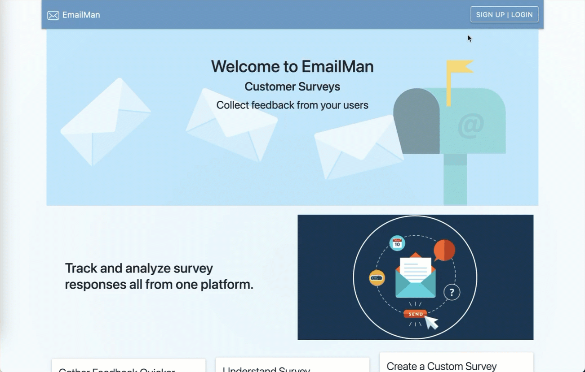

# Emailer

Full Stack React.js and Node Project

- Built to provide an email service to get feedback from clients using Sendgrid as the email provider and Stripe for payment

## Link to Project

[Email-Man](https://emailman.herokuapp.com/)

## Tech Used

- react v17
- express.js
- react-router-dom v6
- mongoose
- passport
- passport Google OAuth20
- sendgrid
- stripe
